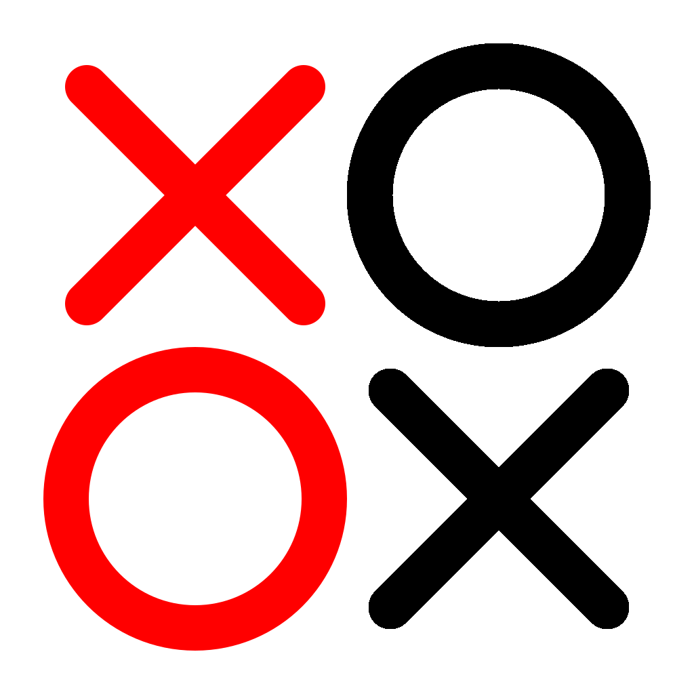
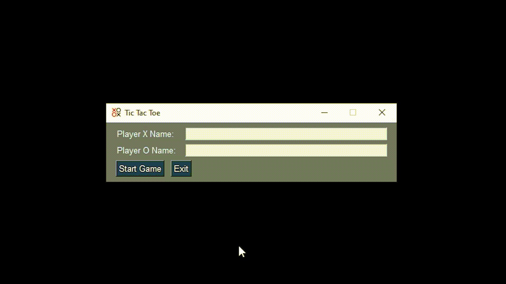

#  CiscoAutoMeetings

    
     
    <i>This is the TicTacToe game builded using PySimpleGUI</i>

## Modules

To run this script you will need this Python modules:
- PySimpleGUI
- Numpy

## Contact

If you have contributions, need support, have suggestions, or just want to get in touch with the me, join my [Discord server](https://discord.gg/XtkJEFU)!

## License

This software is licensed under the terms of the MIT license.
See [LICENSE](LICENSE) for more details.
 
